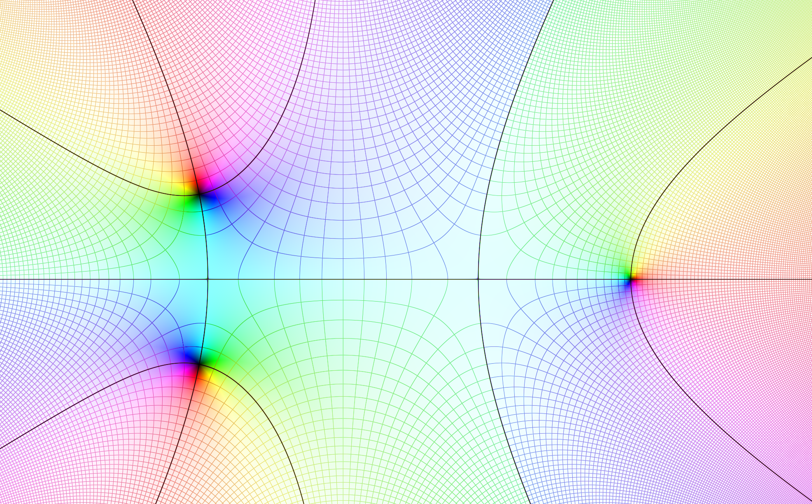
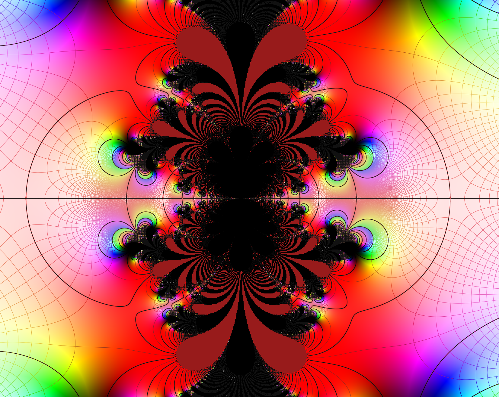
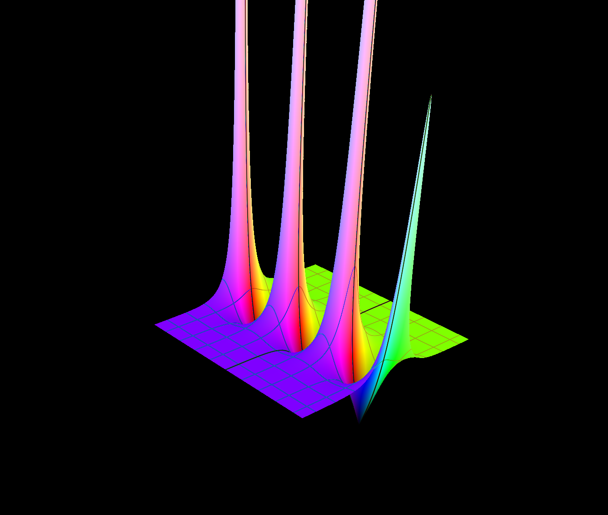
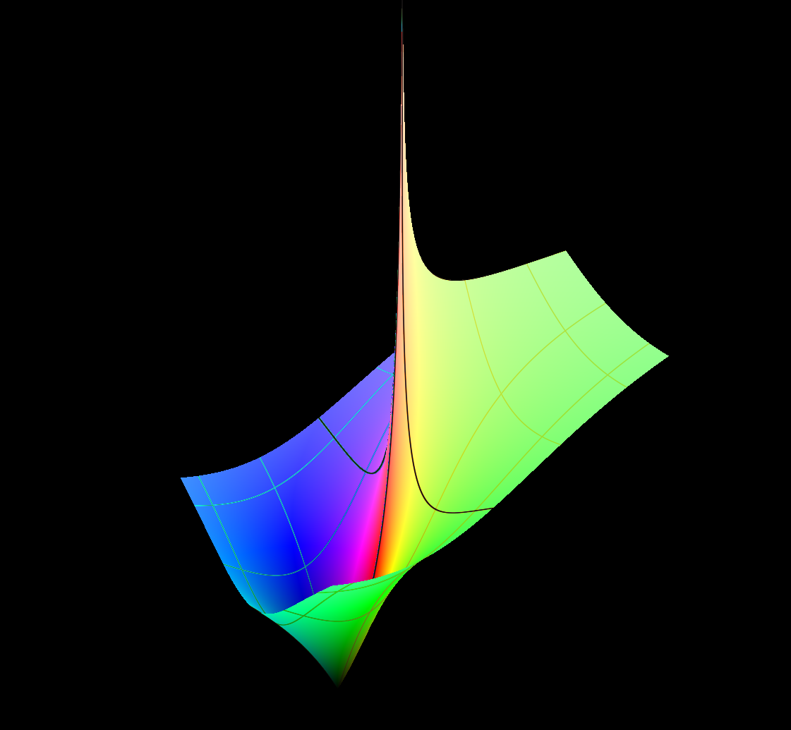

<p align="center">
  
</p>

<p align="center">
    
    
    
    
</p>

<h3 align="center">
    A high-performance, real-time visualizer for complex functions $f: \mathbb{C} \to \mathbb{C}$ in 2D and 3D.
</h3>

<table align="center">
  <tr>
    <td align="center">
      
    </td>
    <td align="center">
      
    </td>
    <td align="center">
      
    </td>
  </tr>
  <tr>
    <td align="center">
      
    </td>
    <td align="center">
      
    </td>
    <td align="center">
      
    </td>
  </tr>
</table>

## Table of Contents
* [Overview](#overview)
* [Quick Start](#quick-start)
  * [Download & Run](#downloading--running)
  * [Build from Source](#building-from-source)
* [Documentation](#documentation)
    * [Math Primer](#math-primer)
    * [Features](#features)
    * [Advanced](#advanced)
* [Contributing](CONTRIBUTING.md)
* [License](LICENSE.md)

## Overview
Complex Plotter is a general-purpose, GPU-accelerated visualizer for complex functions. In standard mathematics, we plot functions on 2D axis ($y = f(x)$). However, complex functions map 2D inputs to 2D outputs, making their plot four-dimensional.
This tool solves this problem using **Domain Coloring** (mapping complex nummbers to colors) and **Height Maps** (mapping output magnitude to height). This tool currently supports every elementary function, complex operators, derivatives, and more.

## Requirements


## Quick Start

### Downloading & Running
A compiled binary for both windows and linux is available in the [Releases]() section of this repository. They are both compiled for 64-bit architectures. 
- [x64 Windows]()
- [x64 Linux]()
To use the program, simply install the executable file, and run it. 
> Note: In Linux, you have to allow the executable to run. To do so, run `chmod +x complex_plotter`

### Building from Source
Before building, ensure you have the following installed:
* **CMake** (Version 3.15 or higher)
* **C++ Compiler** with **C++20** support:
    * *Windows:* Visual Studio 2022 (MSVC) or MinGW64
    * *Linux:* GCC 10+ or Clang 10+
* **Graphics Driver** compatible with **OpenGL 3.3+**
> On Linux, you will need the X11 and GL development libraries:
> ```bash
> sudo apt-get update
> sudo apt-get install build-essential cmake libxrandr-dev libxinerama-dev libxcursor-dev libxi-dev libgl1-mesa-dev
> ```

### 1. Clone the repository
```bash
git clone https://github.com/Sekqies/complex-plotter.git
cd complex-plotter
```

### 2. Configure with CMake
```bash
mkdir build && cd build
cmake ..
```

### 3. Compile
* Unix systems
    ```bash
    make
    ```
* Windows:
    ```bash
    cmake --build . --config Release
    ```
Then, the executable will be available in the `build/` directory.

## Documentation
Since this project is math-intensive and quite complex, there are three main sources of documentation (all contained within the `docs/` [directory](docs/))

### [Math Primer](docs/the-basics.md)
A guide for those not familiar with the mathematical foundation of complex analysis, and would like to understand the theory behind this tool. Uses graphical imagery and animations to better explain some introductory concepts.

### [Features](docs/features.md)
An exhaustive list of features supported by this tool

### [Advanced](docs/advanced.md)
An architectural explanation of how this tool works, internally.
