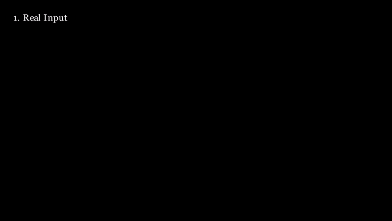
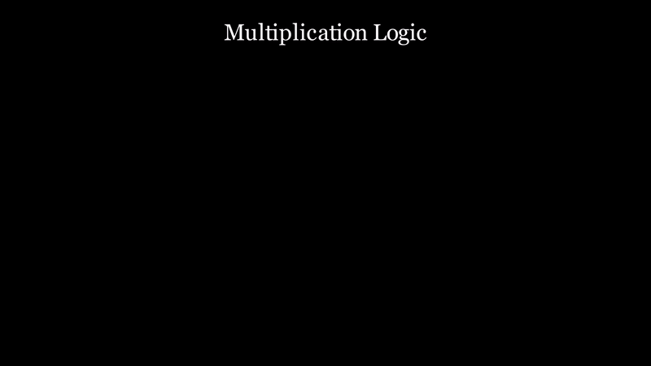
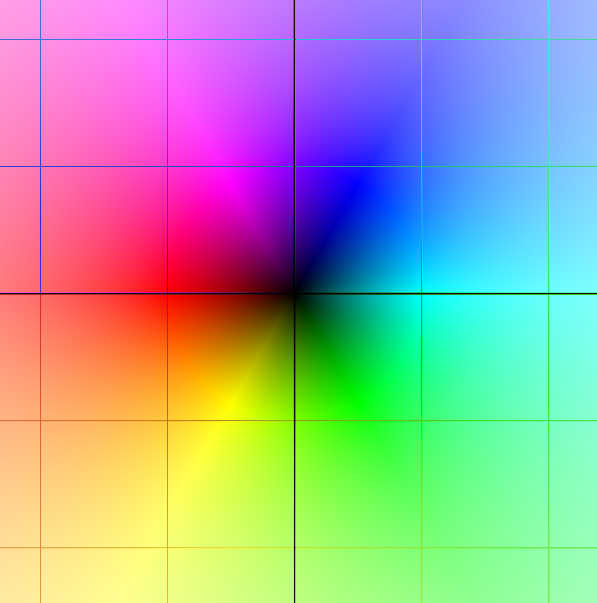
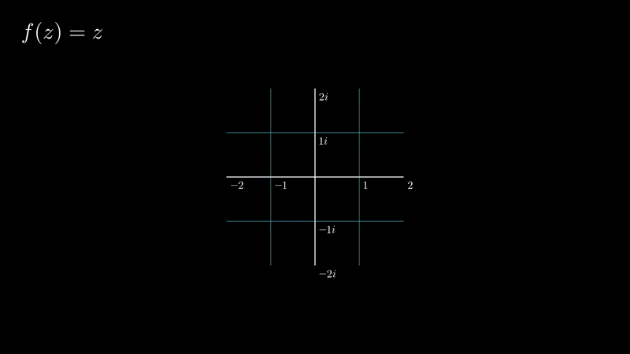
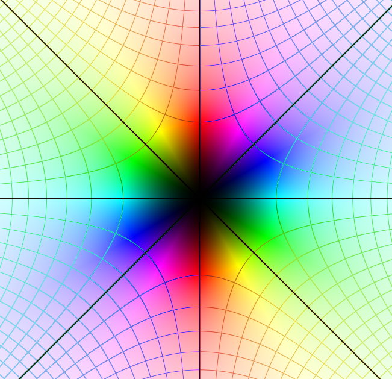

# The Basics
This is a very math-intensive project that not necessarily math-intensive people will see. If you feel like understanding what is going on here, this is a strongly recommended read. If there's anything you're already familiar with, feel free to skip ahead!
Note: This documentation is meant to introduce you to domain coloring and complex analysis, and _not_ teach you to use the tool. 

## TLDR
This plotter represents functions $f: \mathbb{C} \to \mathbb{C}$. The input's real and imaginary components are represented as spacial axes, and the ouput is mapped to a color. This is what you see in your screen represents. 

## Functions and Cartesian Coordinates
Speaking in very general terms, functions are things that take an **input** and produce an **output**. While usual math leads you to think otherwise, a function can take and produce anything of any "type", so long the same input doesn't produce many outputs. 
In mathematics, we can shorthand the sentence "the function $f$ takes input $A$ and outputs $B$" as simply $f:A \to B$. We will be using this notation moving forward.

Usually, we work with real functions, this just being a function $f:\mathbb{R} \to \mathbb{R}$. It's likely you've come across one of such functions like $f(x) = x^2$. We can observe how this function behaves by tabulating the values of $x$ and $f(x)$

Looking at the numbers help, but still isn't quite visual. We can do a better job at it by representing the value of $x$ as a point in a number line, and $f(x)$ as _another_ point in _another_ number line. 

Rather than looking at two individual number lines, we'll make our lives easier and make them orthogonal to each other. Then, instead of having two points, we "merge" these points by drawing out lines perpendicular to our axes, and getting their intersection

Now, the points we chose are just some members of $\mathbb{R}$, but there are infinitely more of them we're not showing! We can keep adding points for more precision and, for the sake of simplicity, assume we eventually reach "infinite" points. We call this process of adding many points **plotting**

And voilà! This is the plot of the _parabola_, the visual representation of this function $f(x) = x^2$ we all know and love. 

## Dimensionality

This strategy for plotting functions works fine for functions $f:\mathbb{R} \to \mathbb{R}$ because it takes one number for input, and produces one for output. Now, suppose we have a function with two inputs (which we would notate by $g:\mathbb{R} \times \mathbb{R} \to \mathbb{R}$), like such:

$$
g(x,y) = x^2 + y^2
$$

Now, we have two inputs and one output. This would mean we need three orthogonal axes: x,y,g(x,y). This would make our function 3D

We call the number of axes we need to represent a set (like $A$, $\mathbb{R}$, $\mathbb{R} \times \mathbb{R}$) this set's **dimensionality**. So, in this example, the dimension of the input of $g$ is **2** (it takes two axes), and of the output **1** (it's one number), making the dimensionality of $g$ be equal to **3**. 
We notate a set $A$'s dimensionality by $dim(A)$. 

This method is, however, limited. The set of the complex numbers ($\mathbb{C}$) has a dimensionality of 2. Suppose we want to plot a function $f:\mathbb{C} \to \mathbb{C}$. With our current method, we can't, because $dim(f) = 4$, and we only have three spatial dimensions! 

## Complex Numbers, Polar Coordinates and Domain Coloring
A complex number $z \in \mathbb{C}$ is defined has many definitions, but the simplest one is $z = a + bi$, where $a,b \in \mathbb{R}$ and $i$ is what we call the **imaginary unit**. $a$ is called the _real component_, and $b$ is the _imaginary_ component. This means that we need two numbers to represent a complex value, hence, $dim(\mathbb{C}) = 2$

The imaginary unit has only one property: $i^2 = -1$. It is a special kind of number because, for any real numbers, this isn't true: we can see from the plot we made that $x^2 \geq 0$. Therefore, we have to redefine things like multiplication and division to properly work in the complexes.

To represent a complex number visually, a number line doesn't suffice. We need two axes, one for $Re(z)$, the real part of $z$, and $Im(z)$, its imaginary part.

Now, if we want to plot a complex _function_ in a 2D screen, one will notice we're already out of dimensions. We have one trick up our sleeves though: color!
If you've ever used an image editing software, you've likely come across an image of the color wheel. In this case, we're using the HSL wheel, which stands for Hue, Saturation and Light. 

Simply, if you draw a line coming out of the circle's center, how _long_ the line is will tell you the color's brightness (or light), and the _angle_ it makes will decide it's color (or hue). This means that we can map a pair of numbers $(r, \theta)$ to a color! Indeed, this means that _color_ has two dimensions.

Since the dimensionality of color and a complex number are the same, we can map one to another! There are many methods to do so, the one used in this plotter being disclosed [here](), but this means we can now plot functions $f: \mathbb{C} \to \mathbb{C}$! In simple terms: the axes serve as input, and the colors, as output. 

If we do this for every color in our screen with, for instance, $f(z) = z$, we get our reference map back:

Notice how the very center is black: this is the root of our equation, when f(z) = 0. Keep track on how each color shows up exactly once, and our grid is perfectly straight - this means that no transformations were done, and this is a 1:1 map.
Now, in the reals, $f(x) = x^2$ is a 2:1 map, because f(x) = f(-x). We can expect a similar behavior in the complexes, but since we're working in higher dimensions, $f(z) = z^2$ will warp the very _grid_ in which the numbers are. 

Think of transformations as moving around the points that our identity function defines, and thus moving their colors with them. We can see this transformation bending and duplicating our grid, like two intersecting parabolas, which is expected!
With all in this in mind, here's how this function looks like:

All checks out! The grid is being warped, and the colors are being repeated (notice how red shows up twice). There are many fun transformations to explore, and I incentivize you to try them out yourself! This the plotter's purpose, after all.
